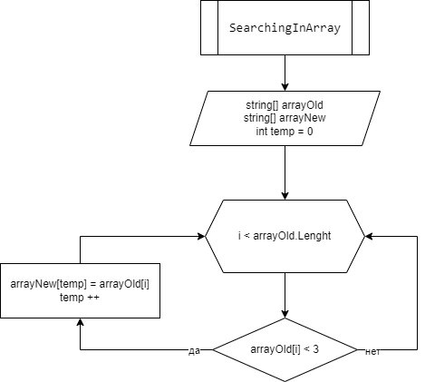

# Задача :

Написать программу, которая из имеющегося массива строк формирует массив из строк, длина которых меньше либо равна 3 символа.

# Описание алгоритма решения:
Объявляем 2 массива: первый заполнен, а второй пустой с длинной равной первому массиву. Далее объявляем метод и с помощью цикла перебираем каждый элемент массива, при выполнении условия внутри цикла ( <=3 ), элемент первого массива записывается в элемент второго массива c индексом temp. После прохода цикла переменная temp увеличивается на 1 и возвращается к циклу for в котором i увеличивается на 1. И так проверяется пока i меньше длины массива - 1.

# Блок-схема:

# Решение находится по [ссылке](Program.cs)